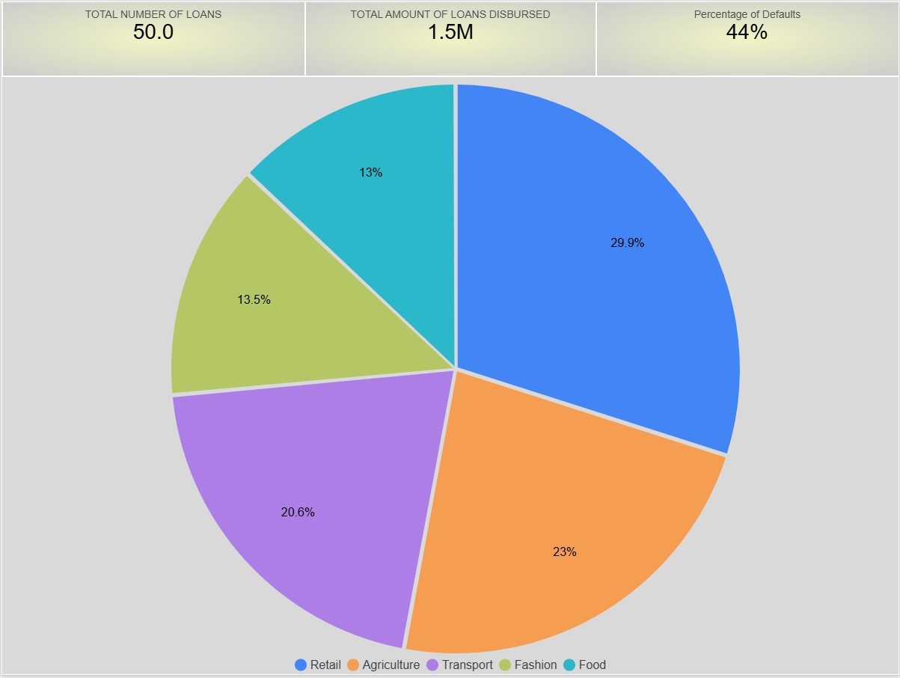
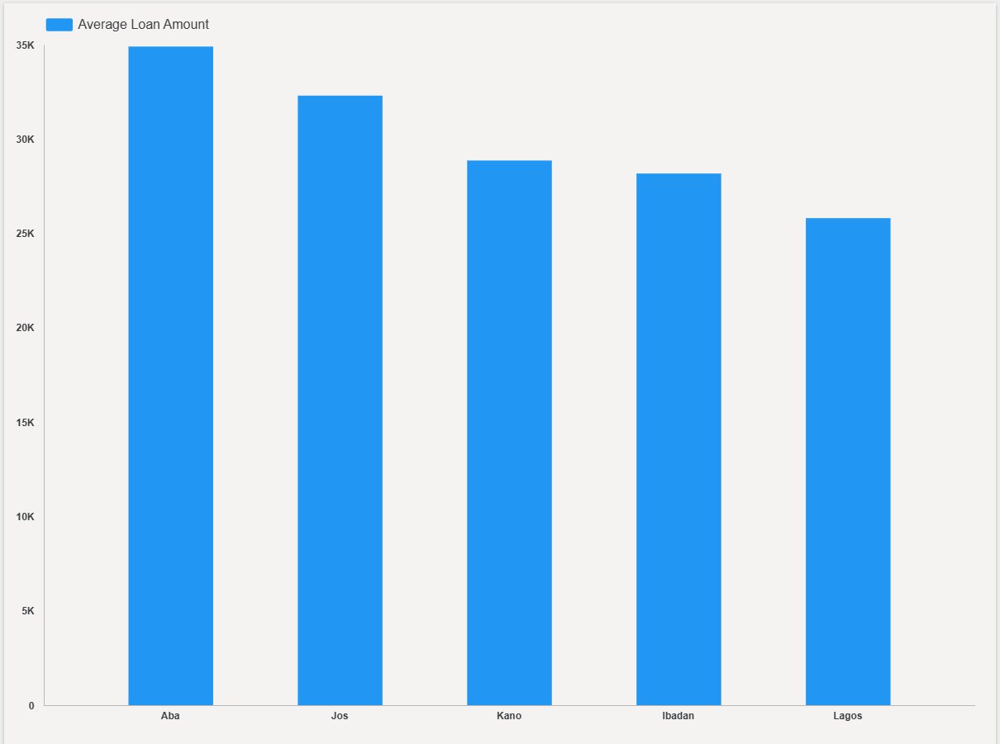
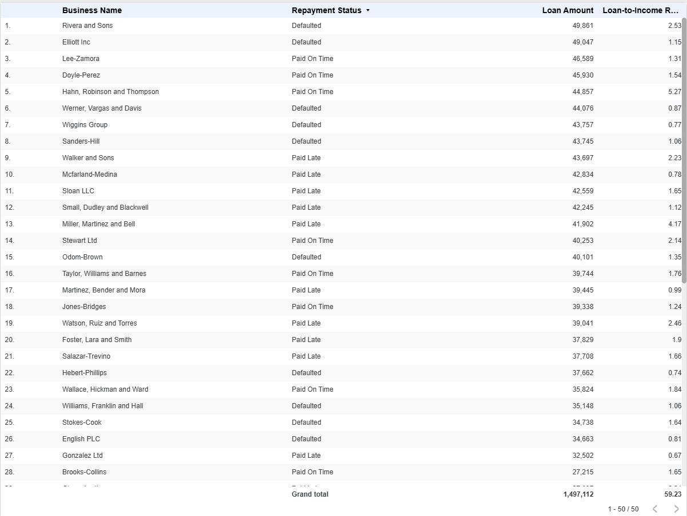
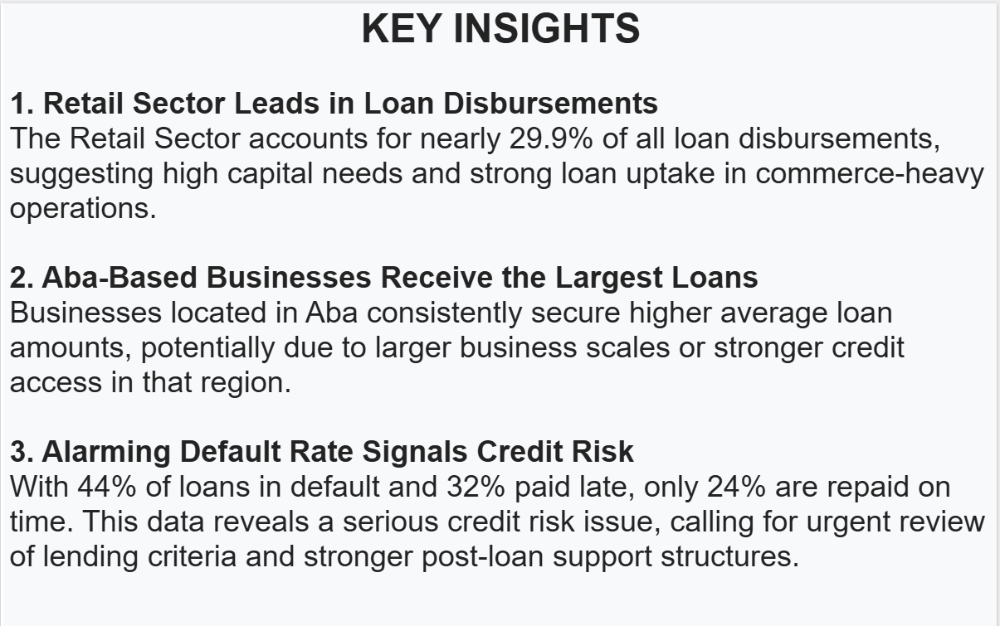

# Alafia Sample Loan Data 📊

This project contains sample loan data from Alafia, analyzed to uncover patterns in loan disbursements, repayment behavior, and sector/location performance.  
The dataset was visualized and explored using **Looker Studio**, and **Excel**.

## 📌 Dataset Overview
- **Total Loans:** 50  
- **Total Amount Disbursed:** ₦1.5M  
- **Default Rate:** 44%  
- **Late Payment Rate:** 32%  
- **On-Time Payment Rate:** 24%

## 📊 Key Insights

1. **Retail Sector Leads in Loan Disbursements**  
   - Accounts for **29.9%** of all loan amounts disbursed.  
   - Suggests high capital needs and strong loan uptake in commerce-heavy operations.

2. **Aba-Based Businesses Secure Larger Loans**  
   - Aba consistently records higher average loan amounts compared to other cities (Jos, Kano, Ibadan, Lagos).  
   - May reflect larger business scales or stronger access to credit.

3. **High Credit Risk Alert**  
   - 44% of loans are in default, 32% are paid late, and only 24% are paid on time.  
   - Indicates the need to review lending criteria and strengthen post-loan support.

## 🛠 Tools & Technologies
- **Data Storage:** Excel (`.xlsx`)  
- **Visualization:** Looker Studio 
- **Analysis:** Spreadsheet formulas

## 📂 Files in This Folder
- `alafia_sample_loan_data.csv` — Raw dataset
- `Alaafia_sample_loan_data.xlsx` — Cleaned dataset  
- `Alaafia_Data_Intern_Skills_Report.pdf` — Visual analysis & insights report

## 📸 Sample Visuals

**Loan Distribution by Sector**  

**Average Loan Amount by Location**  

**Loan Summary Table**  

**Key Insights**

## 🚀 Possible Next Steps
- Build a **predictive model** to forecast defaults.  
- Enhance lending criteria using repayment history and loan-to-income ratios.  
- Explore sector-specific financial support programs.

## Links
- [Looker Studio](https://lookerstudio.google.com/reporting/7ac8ac28-9b83-40b5-8cae-fc698f00081d)
- [Excel](https://docs.google.com/spreadsheets/d/1Fkc7r3eJ9iNICn7MW1VQ6O1nj58UT5rb5_EqvAb24Q4/edit?usp=sharing)

**Author:** Victor Olasunkanmi Odeyemi  
📧 [odeyemivictor01234@gmail.com](mailto:odeyemivictor01234@gmail.com) | 🌐 [LinkedIn](https://www.linkedin.com/in/odeyemivictor)

